## AWS Console

The goal of this exercise is to start an EC2 from the console.

* First go to the `EC2` service:

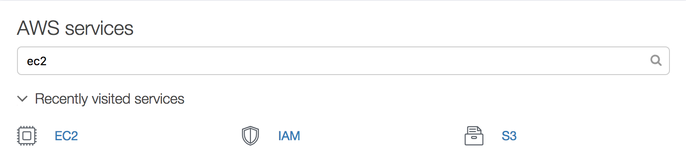

* Then click on `Launch Instance`

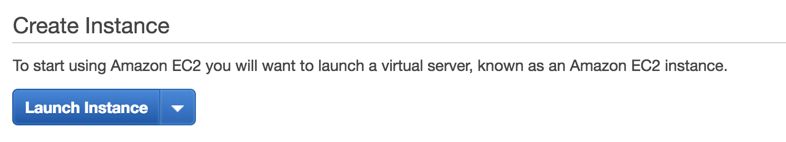

* **Choose AMI** Find and select the latest `AMI` built for `Ubuntu 16.04` using an `EBS` root device and running on `HVM`

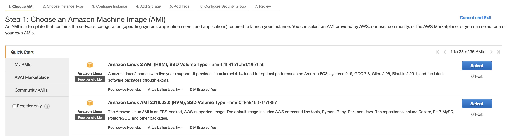

* **Choose Instance Type** Let's use a `t2.micro` for this example

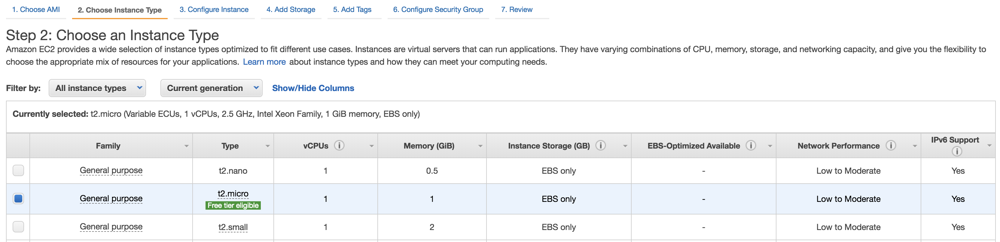

* **Configure Instance** Start the instance in the `default VPC`. Make sure it's placed in a `public subnet` in AZ `us-east-1b`

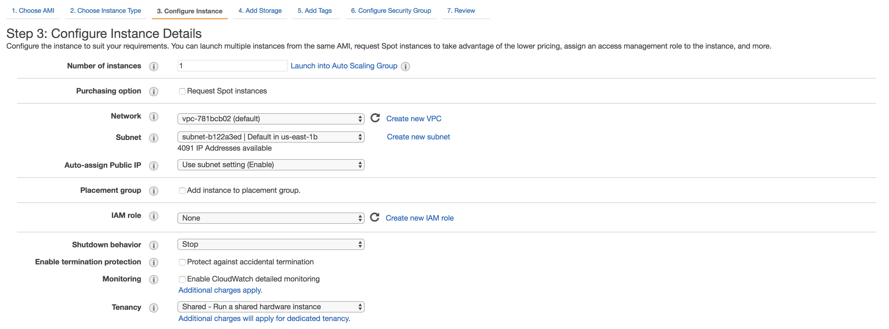

* **Add Storage** Ensure the EBS `root` volume is `20G`

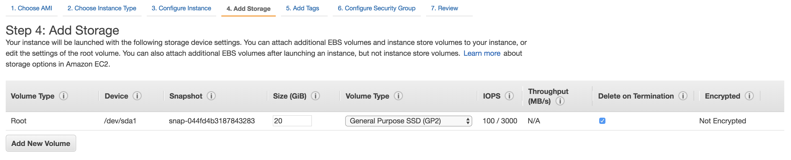

* **Add Tags** Add meaningful tags to your instance to clearly identify it's purpose, environment, etc...

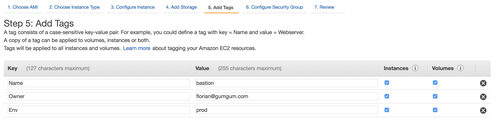

* **Configure Security Group** Create a new security group named `ops` that will allow us to connect to the server using SSH

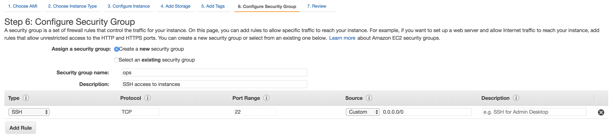

* **Review** Review your instace details and launch the instance !

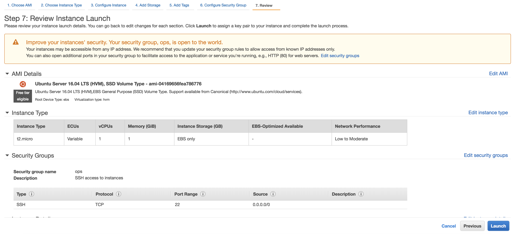

* Create an SSH Keypair in order to be able to connect to your server

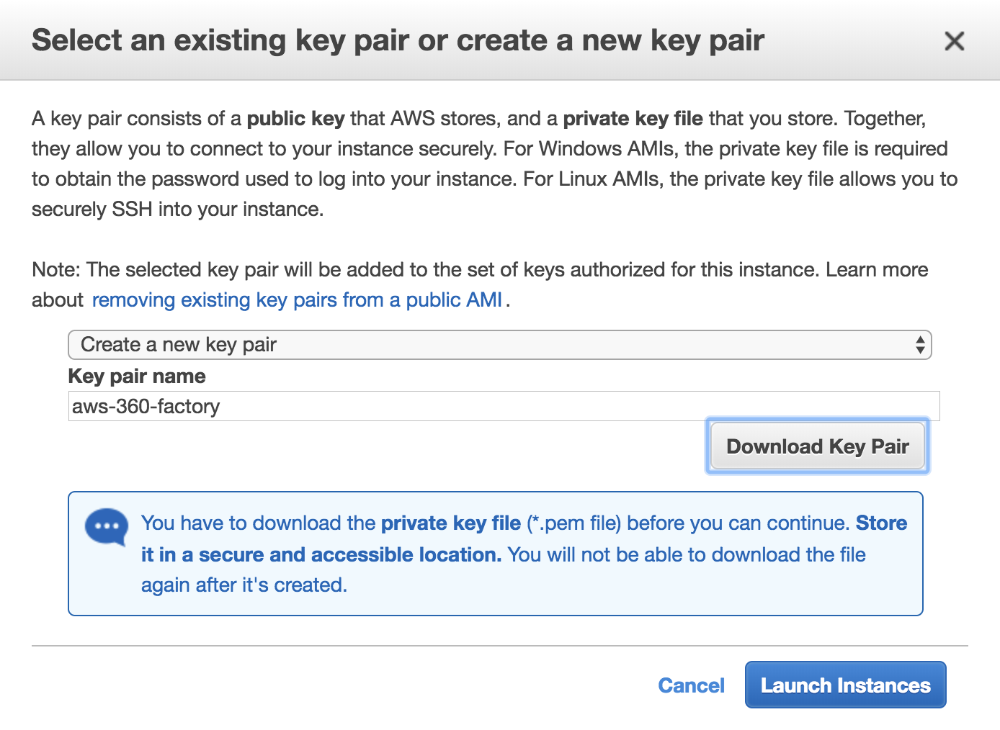

* Visit the EC2 main page and connect to your server

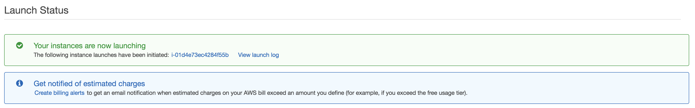
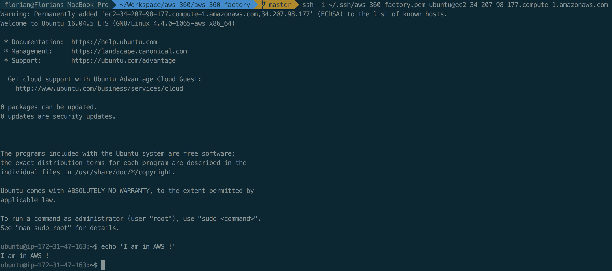
