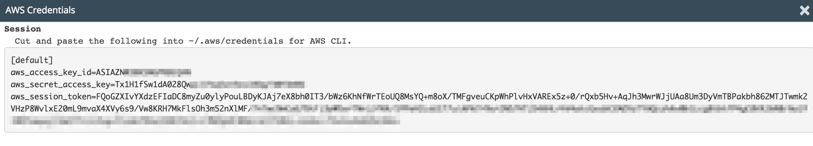

## AWS-Cli

The goal of this exercise is to start an EC2 instance using the `aws-cli`.

* Install the AWS Cli following the [documentation](https://docs.aws.amazon.com/fr_fr/cli/latest/userguide/installing.html)



> :point_up: On AWS Educate, you must reset your AWS credentials frequently as the session expires every 1h

* Make sure your AWS Cli is working properly:

Run `aws sts get-caller-identity` which should return something like:

```json
{
    "Account": "<account-id>",
    "UserId": "AROAJWZZM5V...:user<uid>=<your-email>",
    "Arn": "arn:aws:sts::<account-id>:assumed-role/vocstartsoft/user<uid>=<your-email>"
}
```

* Create a script named `create-ec2.sh` that starts an EC2 server with the same settings than the one started in [AWS Console](../1_console/README.md) but this time using the `aws` command line. Take a look at the `aws-cli` documentation:

    * [EC2 run-instances](https://docs.aws.amazon.com/cli/latest/reference/ec2/run-instances.html)
    * [EC2 describe-images](https://docs.aws.amazon.com/cli/latest/reference/ec2/describe-images.html)
    * [JMESpath](http://jmespath.org/examples.html)
